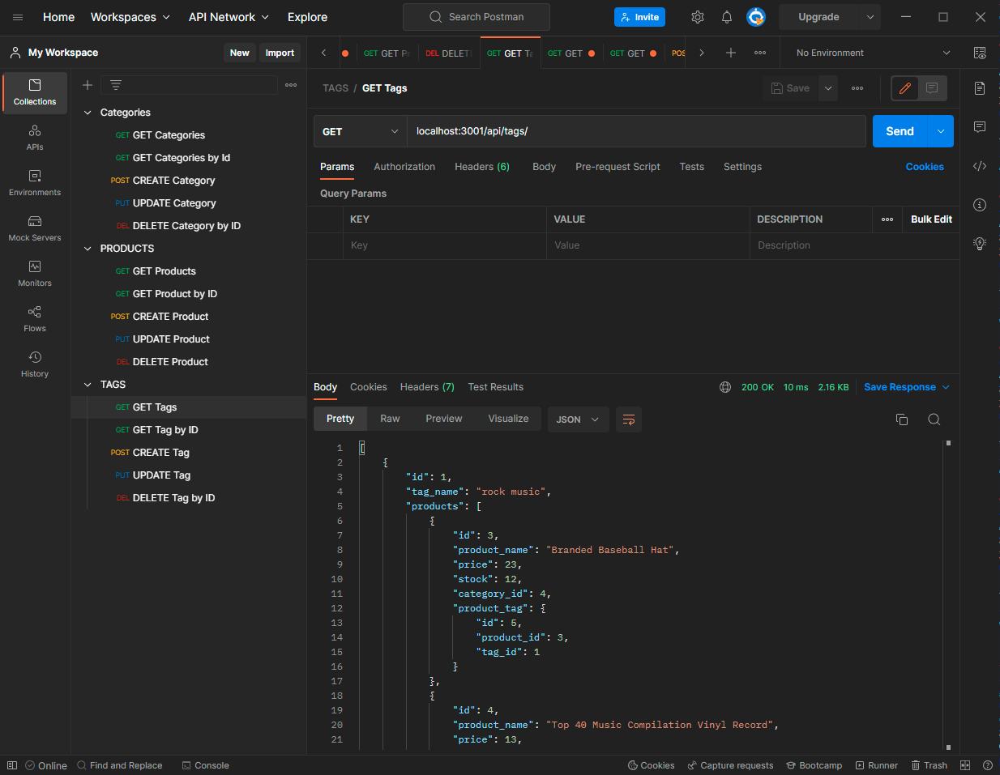

# Khievs-E-Commerce-Back-End 
  ## Description
  This application is the back end of an e-commerce site. The application allows the user to use routes to track and modify the database.
  ## Table of Contents
  - [Installation](#installation)

  - [Usage](#usage)

  - [Credits](#credits)

  - [License](#license)

  - [Badges](#badges)

  - [Features](#features)

  - [Contribute](#contribute)

  - [Tests](#tests)

  ## Installation
  No installation. Clone from github and run.
  ## Usage
  [Github](https://github.com/ChrissnaKhiev/Khievs-E-Commerce-Back-End)

  Start the server and run some GETs, POSTs, PUTs, UPDATES, and DELETEs.

  
  
  
  ## Credits
  None.
  ## License
    [https://github.com/ChrissnaKhiev/Khievs-E-Commerce-Back-End/blob/main/LICENSE](https://github.com/ChrissnaKhiev/Khievs-E-Commerce-Back-End/blob/main/LICENSE)
  ## Badges
  
  
  ## Features
  Allows user to track and modify data from the database on a server.
  ## Contribute
  None.
  ## Tests
  None.